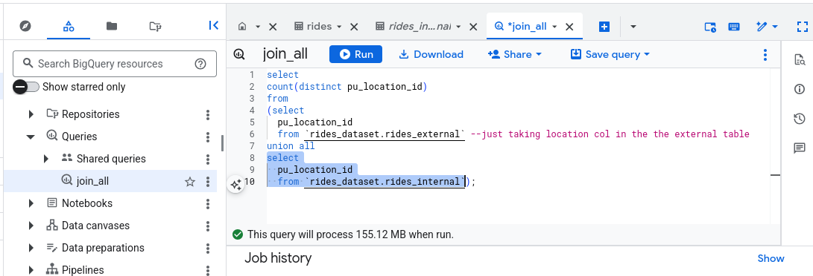

# Module 3: Data Warehouse (BigQuery, DuckDB) 
## Comments and Homework

### Module Comments

This module has been really tough to follow (right now using the dlt path). The main challenge is getting my head around dlt setup:
- becoming familiar with dlt commands, not really there yet.
- Dlt upload script ran into some misunderstandings regarding how GCP credentials were handled.
- Secrets management is pretty straight forward working in Colab and its already part of the GCP/Google ecosystem.
- Those issues with GCP credentials were luckily sorted out with the help of Gemini in Colab
- I was hoping an interface for DuckDB?

Was confused by not being able to find the rides dataset in BigQuery, turns out this should have been expected as I was following the course suggested ingestions steps and the first phase is to move the parquet to duckdb for testing (and later to BQ for prod)

When running the ingestion into BQ ran into a couple of errors which reminded I'd used a separate service account for the dlt/BigQuery module.

Forbidden: 403 POST: Access Denied: User does not have bigquery.jobs.create permission in project...

and 

Forbidden: 403 POST: Access Denied: User does not have permission to query table...

This was sorted out by granting this particular service account the needed permission.

## Homework

### BigQuery Setup

For this sections I have taken out the uris information for safety/security.

**Create an external table using the Yellow Taxi Trip Records.**

~~~~sql
CREATE OR REPLACE EXTERNAL TABLE
  `XXXX.rides_dataset.rides_external` 
    OPTIONS (
    format = 'PARQUET',
    uris = ['gs://XXXX']
  );
~~~~

**Create a (regular/materialized) table in BQ using the Yellow Taxi Trip Records (do not partition or cluster this table).**

~~~~sql
CREATE OR REPLACE TABLE `XXXX.rides_dataset.rides_internal`
AS
SELECT * FROM `XXXX.rides_dataset.rides_external`;
~~~~

**Question 1. Counting records What is count of records for the 2024 Yellow Taxi Data?**

~~~~sql
select
count(*)
from `rides_dataset.rides_internal`;
~~~~

    65,623
    840,402
    20,332,093 <<< 📌
    85,431,289

**Question 2. Data read estimation. Write a query to count the distinct number of PULocationIDs for the entire dataset on both the tables. What is the estimated amount of data that will be read when this query is executed on the External Table and the Table?**

~~~~sql
select
count(distinct pu_location_id)
from
(select
  pu_location_id
  from `rides_dataset.rides_external` --just taking location col in the the external table
union all
select
  pu_location_id
  from `rides_dataset.rides_internal`); --just taking location col in the the external table
~~~~

    18.82 MB for the External Table and 47.60 MB for the Materialized Table
    0 MB for the External Table and 155.12 MB for the Materialized Table <<< 📌
    2.14 GB for the External Table and 0MB for the Materialized Table
    0 MB for the External Table and 0MB for the Materialized Table

**Question 3. Understanding columnar storage. Write a query to retrieve the PULocationID from the table (not the external table) in BigQuery. Now write a query to retrieve the PULocationID and DOLocationID on the same table. Why are the estimated number of Bytes different?**

    BigQuery is a columnar database, and it only scans the specific columns requested in the query. Querying two columns (PULocationID, DOLocationID) requires reading more data than querying one column (PULocationID), leading to a higher estimated number of bytes processed. <<< 📌

    BigQuery duplicates data across multiple storage partitions, so selecting two columns instead of one requires scanning the table twice, doubling the estimated bytes processed.
    
    BigQuery automatically caches the first queried column, so adding a second column increases processing time but does not affect the estimated bytes scanned.

    When selecting multiple columns, BigQuery performs an implicit join operation between them, increasing the estimated bytes processed

For this answer I checked BQ pricing on Google Cloud documentation naamely:

**BigQuery pricing** 

https://cloud.google.com/bigquery/pricing?hl=sv 

BigQuery uses a columnar data structure. You're charged according to the total data processed in the columns you select, and the total data per column is calculated based on the types of data in the column.

**BigQuery query selections best practices**

https://docs.cloud.google.com/bigquery/docs/best-practices-performance-compute

Listed as best practice: Control projection by querying only the columns that you need. Projection refers to the number of columns that are read by your query. Projecting excess columns incurs additional (wasted) I/O and materialization.

**Question 4. Counting zero fare trips. How many records have a fare_amount of 0?**

~~~~sql
SELECT  
count(*) as zero_fare_rides
FROM `rides_dataset.rides_external` 
where fare_amount = 0
~~~~

    128,210
    546,578
    20,188,016
    8,333 <<<

I find it surprising that out of 20M rides just 8k had been with fare zero

**Question 5. Partitioning and clustering**

What is the best strategy to make an optimized table in Big Query if your query will always filter based on tpep_dropoff_datetime and order the results by VendorID (Create a new table with this strategy)

    Partition by tpep_dropoff_datetime and Cluster on VendorID <<< 📌
    Cluster on by tpep_dropoff_datetime and Cluster on VendorID
    Cluster on tpep_dropoff_datetime Partition by VendorID
    Partition by tpep_dropoff_datetime and Partition by VendorID

This asnwer is based on Google Cloud documentation:
https://docs.cloud.google.com/bigquery/docs/clustered-tables#combine-clustered-partitioned-tables

Partitioning and clustering seems to be the general rule? Basically, divide into segments first and then sort. In this case:

 - Partitioning by tpep_dropoff_datetime ensures BigQuery scans only the relevant date segments, significantly reducing data processed and improving query performance and cost efficiency.
- Clustering on VendorID : Within each date partition, clustering by vendor_id further organizes the data.

~~~~sql
CREATE OR REPLACE TABLE `rides_dataset.rides_external_pc`
PARTITION BY 
  DATE(tpep_dropoff_datetime)
CLUSTER BY 
  vendor_id
AS
SELECT *
FROM
 `rides_dataset.rides_external`
~~~~

**Question 6. Partition benefits. Write a query to retrieve the distinct VendorIDs between tpep_dropoff_datetime 2024-03-01 and 2024-03-15 (inclusive) Use the materialized table you created earlier in your from clause and note the estimated bytes. Now change the table in the from clause to the partitioned table you created for question 5 and note the estimated bytes processed. What are these values? Choose the answer which most closely matches.**

    12.47 MB for non-partitioned table and 326.42 MB for the partitioned table
    310.24 MB for non-partitioned table and 26.84 MB for the partitioned table <<< 📌
    5.87 MB for non-partitioned table and 0 MB for the partitioned table
    310.31 MB for non-partitioned table and 285.64 MB for the partitioned table

~~~~sql
--distinct VendorIDs between tpep_dropoff_datetime 2024-03-01 and 2024-03-15

SELECT COUNT(DISTINCT vendor_id)
FROM `rides_dataset.rides_internal`
WHERE
  tpep_dropoff_datetime >= TIMESTAMP '2024-03-01 00:00:00'
  AND tpep_dropoff_datetime <= TIMESTAMP '2024-03-15 23:59:59';

  --This query will process 310.24 MB when run.

SELECT COUNT(DISTINCT vendor_id)
FROM `rides_dataset.rides_external_pc`
WHERE
  tpep_dropoff_datetime >= TIMESTAMP '2024-03-01 00:00:00'
  AND tpep_dropoff_datetime <= TIMESTAMP '2024-03-15 23:59:59';

  --This query will process 26.84 MB when run.
  ~~~~

**Question 7. External table storage. Where is the data stored in the External Table you created?**

    Big Query
    Container Registry
    GCP Bucket <<< 📌
    Big Table

Again from the documentation:
https://docs.cloud.google.com/bigquery/docs/external-data-sources

An external data source is a data source that you can query directly from BigQuery, even though the data is not stored in BigQuery storage. For example, you might have data in a different Google Cloud database, in files in Cloud Storage, or in a different cloud product altogether that you would like to analyze in BigQuery, but that you aren't prepared to migrate.

In my specific case the data (6 parquet files) are stored in a bucket. 

**Question 8. Clustering best practices. It is best practice in Big Query to always cluster your data:**

    True
    False <<< 📌

Smaller size tables (64MB?) don't really benefit that much from clustering or partitioning.

**Question 9. Understanding table scans. No Points: Write a SELECT count(*) query FROM the materialized table you created. How many bytes does it estimate will be read? Why?**

~~~~sql
SELECT 
COUNT(*) 
FROM `rides_dataset.rides_internal` 

-- This query will process 0 B when run.
~~~~